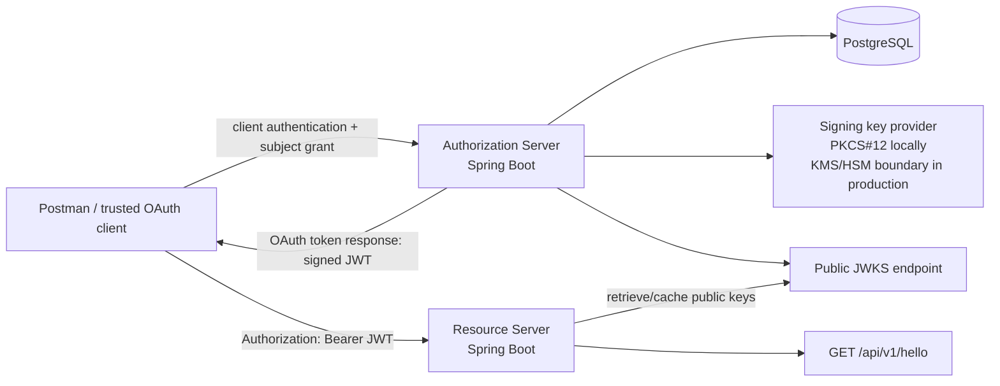

# Implementation Plan — Mini OAuth 2.0 Platform

## 1. Objective

Build a small but production-oriented OAuth 2.0 platform composed of two independently deployable Java/Spring Boot applications:

1. An **Authorization Server** that accepts an authenticated `POST` token request containing a subject and issues a signed JWT access token.
2. A **Resource Server** that exposes a secured Hello World REST endpoint and validates JWT access tokens issued by the Authorization Server.
3. A reproducible demonstration that the Resource Server accepts tokens signed with a newly introduced key without changing or restarting the Resource Server.

The result must be easy to build, run, test, inspect, and explain during the interview. Security behavior must be implemented through Spring Security abstractions rather than handwritten authentication filters or manual JWT parsing.

---

## 2. Important protocol clarification

The PDF intentionally simplifies OAuth 2.0 by saying that a caller can send a `POST` request with a subject and receive a JWT. That operation is **not one of the standard OAuth 2.0 grants** by itself. An unauthenticated endpoint that accepts any `subject` and mints a token would also be an impersonation vulnerability.

The implementation will therefore satisfy the requirement as a **custom OAuth 2.0 extension grant** at Spring Authorization Server's standard token endpoint:

```text
grant_type=urn:portage:params:oauth:grant-type:subject
subject=alice
scope=hello.read
```

The caller must authenticate as a confidential OAuth client using `client_secret_basic`. The server must also verify that:

- the client is registered for this exact custom grant;
- the requested subject exists and is enabled;
- the client is allowed to request a token for that subject;
- the requested scope is a subset of the client's allowed scopes.

This is the strongest way to meet the exercise without pretending that an ad hoc `POST /token?subject=...` endpoint is a standard or safe OAuth flow.

### What to say in the interview

- For a real human user, use Authorization Code with PKCE and derive `sub` from the authenticated user. Do not let the client choose it.
- For a service acting as itself, use Client Credentials and set `sub` to a service/client identifier.
- This exercise explicitly asks the caller to supply a subject, so the implementation models it as a tightly restricted extension grant for a trusted client.
- The custom subject grant will not be advertised as a general-purpose user authentication solution.
- OpenID Connect is not needed and will remain disabled.

---

## 3. Acceptance criteria

| Requirement | Implementation | Proof |
|---|---|---|
| Two REST APIs | Separate `authorization-server` and `resource-server` Spring Boot applications | Both start independently and have separate container images |
| POST request with subject returns token | Authenticated custom grant on `POST /oauth2/token` | Postman request obtains a standards-shaped OAuth token response |
| Signed JWT | RSA signature through Spring's `JwtEncoder`/token generator | JWT header contains `alg`, `kid`, and `typ`; signature is test-verified |
| Secured Hello World endpoint | `GET /api/v1/hello` requires `SCOPE_hello.read` | No token → 401; correct token → 200 |
| Resource Server validates token | Spring Security OAuth2 Resource Server with issuer, audience, type, algorithm, time, and signature validation | Negative integration-test matrix |
| New signing key is accepted | JWKS endpoint, unique `kid`, overlapping old/new public keys, automatic JWKS refresh | Key-rotation integration test and demo |
| Java/Spring Boot | Java 21.0.11 LTS, Spring Boot 4.1, Spring Security 7.1 | Maven build metadata |
| Quality and testability | Hexagonal boundaries where useful, unit/integration/end-to-end tests, static checks | `./mvnw verify` |
| Production readiness | External configuration, persistent client data, managed keys boundary, observability, hardened containers, CI | Deployment and operations sections below |
| OWASP Top 10:2025 | Explicit control/evidence mapping for all ten categories, plus API-specific safeguards | OWASP traceability matrix and security regression suite |
| AI usage can be discussed | Versioned `docs/ai-usage.md` with prompts, accepted changes, rejected suggestions, and manual verification | Interview artifact |

---

## 4. Chosen technology stack

Use one deliberate stack rather than several interchangeable options.

| Area | Choice | Reason |
|---|---|---|
| Language | **Java 21.0.11 LTS** | Matches the installed JDK, is an established LTS release, and is supported by Spring Boot 4.1 |
| Framework | **Spring Boot 4.1.x** | Current stable production line at plan time |
| Security | **Spring Security 7.1.x** | Framework-owned bearer-token processing and authorization |
| Authorization Server | **Spring Security Authorization Server support** | Implements token endpoint, registered clients, OAuth errors, metadata, token generation, and JWKS integration |
| Build | **Maven Wrapper, multi-module build** | Familiar for Java teams and gives one reproducible verification command |
| API style | **Spring MVC** | The application is small and not I/O-streaming; servlet security is direct and easy to explain |
| JWT/JWK implementation | **Spring Security JOSE backed by Nimbus** | Already integrated by Spring; no direct low-level token library use in application code |
| Signature | **RS256 with 3072-bit RSA keys** | Asymmetric trust separation, broad interoperability, and RFC 9068 compatibility |
| Persistence | **PostgreSQL + Spring JDBC + Flyway** | Durable registered-client/authorization data and explicit, reviewable SQL migrations |
| Testing | **JUnit 5, AssertJ, Spring Security Test, Testcontainers PostgreSQL, Awaitility where polling is necessary** | Realistic security and persistence tests without shared external infrastructure |
| Runtime packaging | **Spring Boot OCI images through Cloud Native Buildpacks** | Reproducible, layered, non-root container images without handwritten Dockerfile drift |
| Observability | **Spring Boot Actuator + Micrometer Prometheus registry + structured JSON logs** | Health, metrics, and operational visibility |
| Local orchestration | **Docker Compose** | One command starts PostgreSQL and both applications |
| API demonstration | **Postman collection and environment committed to the repository** | Directly satisfies the PDF and is easy to present |
| CI | **GitHub Actions** | Natural fit for the requested GitHub delivery |

### Version policy

- Pin the Spring Boot parent to the selected `4.1.x` patch version.
- Let the Spring Boot dependency-management BOM select compatible Spring Security, Nimbus, Jackson, Flyway, and testing versions.
- Do not declare versions for Spring-managed dependencies.
- Pin Maven plugins and container-image digests or immutable version tags.
- Commit `.mvn/wrapper` and `mvnw`; CI and local builds use the wrapper.
- Do not use milestone, release-candidate, snapshot, or deprecated dependencies.
- Before submission, run the complete build against the latest compatible patch releases and record them in the README.

---

## 5. High-level architecture



### Architectural rules

- The two applications are independently deployable and have different ports, configurations, health checks, and container images.
- The Resource Server never receives a private key.
- The Resource Server does not depend on Authorization Server Java classes or a shared "security common" module.
- The protocol boundary is the JWT/JWKS contract: issuer, audience, claims, algorithm, and key identifiers.
- The Authorization Server is the only component allowed to sign tokens.
- The client treats the access token as opaque and does not make authorization decisions by decoding it.
- The Resource Server is stateless and does not store sessions or token state.

---

## 6. Repository layout

```text
oauth2-mini-platform/
├── .github/
│   ├── dependabot.yml
│   └── workflows/
│       └── ci.yml
├── .mvn/wrapper/
├── authorization-server/
│   ├── pom.xml
│   └── src/
│       ├── main/
│       │   ├── java/com/portage/oauth/authorization/
│       │   └── resources/
│       │       ├── application.yml
│       │       └── db/migration/
│       └── test/
├── resource-server/
│   ├── pom.xml
│   └── src/
│       ├── main/
│       │   ├── java/com/portage/oauth/resource/
│       │   └── resources/application.yml
│       └── test/
├── end-to-end-tests/
│   ├── pom.xml
│   └── src/test/
├── postman/
│   ├── OAuth2-Mini-Platform.postman_collection.json
│   └── Local.postman_environment.json
├── deploy/
│   ├── compose.yml
│   └── keys/
│       └── README.md
├── docs/
│   ├── architecture-decisions/
│   │   ├── 0001-use-spring-authorization-server.md
│   │   ├── 0002-custom-subject-grant.md
│   │   ├── 0003-rsa-jwks-and-key-rotation.md
│   │   └── 0004-jwt-validation-policy.md
│   ├── ai-usage.md
│   ├── demo-runbook.md
│   ├── security-verification.md
│   └── threat-model.md
├── .editorconfig
├── .gitignore
├── mvnw
├── mvnw.cmd
├── pom.xml
└── README.md
```

Do not create a shared runtime module between the servers. Small duplicated constants are safer than coupling the Resource Server to the Authorization Server's implementation. Test utilities may live only in test source sets.

---

## 7. Token request and API contracts

### 7.1 Request a JWT access token

```http
POST /oauth2/token HTTP/1.1
Host: authorization.local
Authorization: Basic base64(postman-demo-client:client-secret)
Content-Type: application/x-www-form-urlencoded
Accept: application/json

grant_type=urn%3Aportage%3Aparams%3Aoauth%3Agrant-type%3Asubject&
subject=alice&
scope=hello.read
```

Expected response:

```http
HTTP/1.1 200 OK
Cache-Control: no-store
Pragma: no-cache
Content-Type: application/json

{
  "access_token": "<signed-jwt>",
  "token_type": "Bearer",
  "expires_in": 300,
  "scope": "hello.read"
}
```

No refresh token will be issued. The trusted client can authenticate and repeat the grant when it needs a new five-minute access token. A refresh token would add a longer-lived credential without adding value to this flow.

### 7.2 JWT contract

JWT protected header:

```json
{
  "alg": "RS256",
  "kid": "opaque-unique-key-id",
  "typ": "at+jwt"
}
```

JWT claims:

```json
{
  "iss": "https://authorization.example.com",
  "sub": "alice",
  "aud": ["hello-api"],
  "iat": 1785340800,
  "nbf": 1785340800,
  "exp": 1785341100,
  "jti": "b183c7a4-4d91-4ef2-b853-65b820290e02",
  "client_id": "postman-demo-client",
  "scope": "hello.read"
}
```

Rules:

- `iss` is an explicit, stable HTTPS URL; never derive it from arbitrary request headers.
- `sub` is a stable identifier, not an unrestricted display name or sensitive profile object.
- `aud` contains only the intended API identifier, `hello-api`.
- `iat`, `nbf`, and `exp` use an injected UTC `Clock`.
- Production access-token lifetime is five minutes.
- `jti` is cryptographically unpredictable/UUID-based and unique.
- `client_id` identifies the client that obtained the access token.
- `scope` is the actual granted scope, not blindly copied from the request.
- No password, secret, email profile, or unnecessary personal data is placed in the JWT.
- The signed JWT is integrity-protected, not encrypted; clients can read its payload.

### 7.3 Call the protected API

```http
GET /api/v1/hello HTTP/1.1
Host: resource.local
Authorization: Bearer <signed-jwt>
Accept: application/json
```

Successful response:

```http
HTTP/1.1 200 OK
Content-Type: application/json

{
  "message": "Hello, alice!",
  "subject": "alice"
}
```

The endpoint requires `SCOPE_hello.read`.

### 7.4 Authentication and authorization errors

- Missing, malformed, expired, incorrectly signed, wrong-issuer, wrong-audience, wrong-type, or unsupported-algorithm token → `401 Unauthorized`.
- Valid token without `hello.read` → `403 Forbidden`.
- Bearer authentication failures include an appropriate `WWW-Authenticate: Bearer` header.
- OAuth token-endpoint failures use OAuth error payloads such as `invalid_request`, `invalid_client`, `unauthorized_client`, `invalid_grant`, and `invalid_scope`.
- Error responses never reveal whether a particular subject exists or expose stack traces, secrets, tokens, or key material.

---

## 8. Authorization Server implementation

### 8.1 Dependencies

Use only the required production starters:

- `spring-boot-starter-oauth2-authorization-server`
- `spring-boot-starter-jdbc`
- `spring-boot-starter-validation`
- `spring-boot-starter-actuator`
- `flyway-core`
- PostgreSQL JDBC driver
- Micrometer Prometheus registry

Test scope:

- `spring-boot-starter-test`
- `spring-security-test`
- `spring-boot-testcontainers`
- Testcontainers PostgreSQL
- Awaitility only for eventual key-refresh assertions

Do not add JPA, Lombok, a second JWT library, or a generic mapping framework. The domain is too small to justify them, and cryptographic/token work should remain behind Spring Security.

### 8.2 Package structure

```text
com.portage.oauth.authorization
├── AuthorizationServerApplication
├── config
│   ├── AuthorizationServerSecurityConfiguration
│   ├── AuthorizationServerProperties
│   ├── ClientConfiguration
│   └── ObservabilityConfiguration
├── grant.subject
│   ├── SubjectGrantAuthenticationToken
│   ├── SubjectGrantAuthenticationConverter
│   ├── SubjectGrantAuthenticationProvider
│   └── SubjectGrantType
├── subject
│   ├── AuthorizedSubject
│   ├── AuthorizedSubjectRepository
│   └── SubjectAuthorizationPolicy
├── token
│   └── AccessTokenCustomizer
├── key
│   ├── SigningKeyProvider
│   ├── Pkcs12SigningKeyProvider
│   └── SigningKeyProperties
└── audit
    └── TokenIssuanceAuditPublisher
```

### 8.3 Spring Authorization Server configuration

Create an authorization-server `SecurityFilterChain` with the highest order and apply Spring's authorization-server configurer. Configure:

- a fixed issuer from validated configuration;
- `/oauth2/token`;
- `/oauth2/jwks`;
- `/.well-known/oauth-authorization-server`;
- client authentication using `client_secret_basic`;
- JWT/self-contained access tokens;
- no OpenID Connect initialization;
- no browser login or consent UI because this exercise has no interactive user flow;
- OAuth-standard error handling from Spring Authorization Server.

A second filter chain handles non-protocol paths:

- allow only the framework error endpoint as required;
- deny every other application endpoint;
- management endpoints run on an internal management port/network.

Do not globally disable every Spring Security protection. Configure stateless behavior only where the protocol requires it.

### 8.4 Registered client

Provision one demonstration client:

```text
client_id: postman-demo-client
authentication method: client_secret_basic
grant type: urn:portage:params:oauth:grant-type:subject
allowed scope: hello.read
access token format: self-contained JWT
access token TTL: 5 minutes
refresh tokens: disabled
```

Security requirements:

- Generate at least 256 bits of entropy for the plaintext client secret.
- Store the secret through Spring's `PasswordEncoder`, never as plaintext.
- Supply the initial plaintext secret through a local-only secret file/environment variable.
- Never commit the secret or print it in startup logs.
- Support secret replacement through controlled provisioning, with an operational overlap window if the deployment process needs it.
- Production client registration is an administrative operation, not an unprotected public API.

### 8.5 Custom subject extension grant

Implement the extension using the Spring Authorization Server extension points:

1. `SubjectGrantAuthenticationConverter`
   - Handle only the exact custom grant URI.
   - Require exactly one nonblank `subject` parameter.
   - Require at most one `scope` parameter.
   - Reject duplicate parameters instead of silently selecting the first.
   - Apply a strict maximum subject length and canonical format.
   - Obtain the already-authenticated OAuth client principal from the security context.
   - Never accept a `client_id` value as proof of client authentication.

2. `SubjectGrantAuthenticationToken`
   - Carry the authenticated client, normalized subject, requested scopes, and safe additional parameters.
   - Remain unauthenticated until processed by the provider.
   - Avoid retaining the raw HTTP request.

3. `SubjectGrantAuthenticationProvider`
   - Confirm that the client principal is authenticated.
   - Confirm that the registered client allows the custom grant.
   - Load the subject and verify that it is enabled.
   - Apply `SubjectAuthorizationPolicy` to confirm that the client may act for that subject.
   - Intersect requested scopes with registered and policy-approved scopes.
   - Reject an empty or unauthorized scope set.
   - Build an `OAuth2TokenContext`.
   - Delegate token creation to Spring's `OAuth2TokenGenerator`; do not concatenate or sign JWTs manually.
   - Persist the resulting `OAuth2Authorization` through `OAuth2AuthorizationService`.
   - Persist a sanitized audit-outbox event in the same database transaction.
   - Return a token only after authorization and audit-outbox persistence succeed; never fail open or return a partially committed result.

4. Register the converter and provider on the token endpoint through the authorization-server DSL.

5. Return OAuth-compatible error codes. Subject-not-found and subject-not-permitted should both become a generic `invalid_grant` response to avoid enumeration.

### 8.6 Subject authorization model

Create minimal tables:

```text
authorized_subject
- subject_id (primary key)
- enabled
- created_at
- updated_at

client_subject_permission
- registered_client_id
- subject_id
- scope
- enabled
- created_at

security_audit_outbox
- event_id (primary key)
- event_type
- safe_payload
- occurred_at
- published_at
- delivery_attempts
```

The demonstration migration seeds `alice` and grants only `postman-demo-client` the `hello.read` scope for that subject. Seed data containing a client secret exists only in the local profile/test fixtures.

This policy makes the subject parameter meaningful without allowing arbitrary impersonation.

### 8.7 Token customization

Use `OAuth2TokenCustomizer<JwtEncodingContext>` to:

- set `typ=at+jwt`;
- select the active key's `kid`;
- set `aud=["hello-api"]`;
- set the validated `sub`;
- set `client_id`;
- set the granted `scope`;
- set `iat`, `nbf`, `exp`, and `jti`;
- reject issuance if the required context or active signing key is unavailable.

Never allow request parameters to override `iss`, `aud`, `exp`, `client_id`, `kid`, or signing algorithm.

### 8.8 Persistence

Use Spring Authorization Server's JDBC repositories/services with PostgreSQL:

- `JdbcRegisteredClientRepository`
- `JdbcOAuth2AuthorizationService`
- the project-specific subject/permission repository

Manage all schemas with Flyway:

- copy the compatible Spring Authorization Server schemas into versioned project migrations;
- add project-owned subject and permission migrations;
- add the transactional security-audit outbox migration;
- never rely on Hibernate auto-DDL;
- validate migrations in integration tests against a real PostgreSQL container;
- let Flyway validate migration checksums and fail startup on unexpected tampering;
- keep local seed data separate from production migrations.

Use a bounded HikariCP pool with connection/query timeouts. Wrap subject authorization, authorization persistence, and audit-outbox insertion in one transaction. A failed database dependency makes the Authorization Server unready, not silently degraded.

---

## 9. JWT signing and key management

### 9.1 Key design

- Use 3072-bit RSA key pairs and `RS256`.
- Every key has a unique, opaque `kid`.
- JWTs always include `kid`.
- Public JWKs include only public RSA parameters plus `kid`, `kty`, `use=sig`, and `alg=RS256`.
- Private RSA parameters must never appear in `/oauth2/jwks`, logs, errors, source control, container layers, or metrics.
- Generate keys outside normal application startup.
- Inject `SecureRandom` only in key-generation tooling and token-ID generation as needed.

### 9.2 Key-provider boundary

Define a small `SigningKeyProvider` interface that supplies:

- the active signing key;
- all public verification keys that should currently be published;
- the active `kid`;
- health information that reveals status, not key material.

Implement:

- `Pkcs12SigningKeyProvider` for the local demonstration and portable deployment baseline;
- an in-memory provider only under test source code.

The PKCS#12 file is mounted read-only, its password comes from a secret manager/file, and startup fails closed if:

- the active alias does not exist;
- its private key is unavailable;
- the key size or algorithm is unacceptable;
- two keys have the same `kid`;
- the configured active key is not among the published public keys.

The interface is the seam for a production KMS/HSM-backed signer. A real deployment should keep private signing operations in a managed KMS/HSM when the platform provides one; application code and Resource Server behavior remain unchanged.

### 9.3 JWKS endpoint

Spring Authorization Server exposes `/oauth2/jwks` from the configured `JWKSource`.

Requirements:

- endpoint is publicly readable over HTTPS;
- response contains public keys only;
- set sensible `Cache-Control` and `ETag` behavior through the deployment/gateway;
- keep the endpoint highly available because Resource Servers need it when they encounter a new `kid`;
- emit a metric for successful/failed JWKS requests without logging key bodies as arbitrary request data.

### 9.4 Rotation lifecycle

Use an overlap strategy:

1. **Initial state:** key A is active and JWKS publishes A.
2. **Prepare:** generate key B externally.
3. **Publish and activate:** deploy key bundle A+B and set B active. New tokens use `kid=B`; JWKS publishes A and B.
4. **Verification refresh:** when the Resource Server sees B and its cache contains only A, it refreshes JWKS and validates the token without configuration changes or restart.
5. **Overlap:** continue publishing A for at least the maximum access-token lifetime plus clock skew and deployment/cache propagation margin.
6. **Retire:** after all A-signed tokens must be expired, deploy a bundle that publishes only B.
7. **Destroy/archive:** apply the organization's key-retention policy to A's private material and retain an audit record of the rotation.

Never remove A at the same moment B becomes active. Doing so would invalidate still-live A-signed tokens and could create an outage.

### 9.5 Exercise-specific rotation demonstration

Prepare locally generated, gitignored key bundles:

- V1: A active; publishes A.
- V2: B active; publishes A+B.

Demo:

1. Start V1 and obtain token A.
2. Call the API with token A; the Resource Server caches key A.
3. Replace/restart only the Authorization Server with V2.
4. Obtain token B and confirm its different `kid`.
5. Call the same Resource Server with token B; it discovers B through JWKS and returns 200.
6. Call with still-unexpired token A; it also returns 200 during overlap.

The automated integration test must reproduce this transition with a controllable JWKS fixture and prove that no Resource Server restart or local public-key replacement occurs.

---

## 10. Resource Server implementation

### 10.1 Dependencies

- `spring-boot-starter-web`
- `spring-boot-starter-oauth2-resource-server`
- `spring-boot-starter-validation`
- `spring-boot-starter-actuator`
- Micrometer Prometheus registry

Testing:

- `spring-boot-starter-test`
- `spring-security-test`
- a local controllable JWKS HTTP fixture in integration tests
- Awaitility only where an asynchronous refresh must be observed

No database is needed.

### 10.2 Package structure

```text
com.portage.oauth.resource
├── ResourceServerApplication
├── api
│   ├── HelloController
│   └── HelloResponse
├── config
│   ├── ResourceServerSecurityConfiguration
│   └── JwtValidationProperties
├── security
│   ├── AudienceValidator
│   ├── AccessTokenTypeValidator
│   └── JwtAuthenticationConfiguration
└── error
    ├── BearerAuthenticationEntryPoint
    └── BearerAccessDeniedHandler
```

### 10.3 Security filter chain

Configure:

- session policy `STATELESS`;
- OAuth2 Resource Server JWT support;
- `GET /api/v1/hello` requires `SCOPE_hello.read`;
- actuator health probes are available only on the internal management interface;
- every unspecified application endpoint is denied;
- CSRF is disabled for this bearer-token-only REST API because no browser cookie authenticates requests;
- CORS is disabled by default and enabled only for explicit trusted origins if a browser client is later introduced;
- no form login, HTTP Basic, anonymous privileged endpoint, or fallback authentication mechanism.

Use Spring's `BearerTokenAuthenticationFilter`; do not write a custom JWT servlet filter.

### 10.4 JWT decoder and validation

Build/configure a Nimbus-backed `JwtDecoder` from:

- expected issuer;
- explicit JWKS URI;
- accepted algorithm allowlist containing only `RS256`;
- expected audience `hello-api`.

Specifying both issuer and JWKS URI keeps issuer validation while avoiding unnecessary discovery coupling during startup. The decoder still retrieves the Authorization Server's public keys and refreshes them when an unknown `kid` appears.

Treat JWKS retrieval as a fixed outbound trust boundary:

- accept the URI only from validated deployment configuration, never from token headers or request data;
- require HTTPS and an allowlisted host in production;
- disable HTTP redirects;
- validate the TLS certificate and hostname;
- allow only `application/json` with a bounded response size and key count;
- use bounded connection/read timeouts and bounded retries;
- reject malformed, duplicate-`kid`, wrong-use, wrong-algorithm, or weak public keys;
- cache the last valid set, but never replace it with a failed/partially parsed response;
- prevent attacker-controlled `jku`, `x5u`, or embedded `jwk` headers from changing the key source.

Compose validators for:

- exact `iss`;
- `aud` contains `hello-api`;
- `exp` is in the future;
- `nbf` is not in the future beyond a maximum 60-second clock-skew allowance;
- required `sub`, `client_id`, `jti`, and `scope` claims are present and correctly typed;
- `typ` is exactly `at+jwt` or `application/at+jwt`;
- algorithm is exactly `RS256`;
- signature validates against the public key selected by `kid`.

Reject:

- `alg=none`;
- HMAC algorithms;
- a token with no `kid`;
- a token signed by an unpublished key;
- malformed/multiple bearer credentials;
- a JWT that is syntactically valid but has the wrong issuer, audience, type, scope, or time claims.

Configure one injected UTC `Clock` for custom validation and deterministic tests.

### 10.5 Authority mapping

Use Spring's standard scope mapping:

```text
scope "hello.read" → GrantedAuthority "SCOPE_hello.read"
```

Do not map the subject directly to an authority. Authentication (`sub`) and authorization (`scope`) are different concerns.

### 10.6 Hello endpoint

Implement a thin controller:

```java
@GetMapping("/api/v1/hello")
public HelloResponse hello(@AuthenticationPrincipal Jwt jwt)
```

Return an immutable Java `record`. Read the subject from the already-validated Spring Security `Jwt` principal. The controller must never decode a raw token or repeat signature validation.

---

## 11. Configuration model

### Authorization Server required configuration

```text
AUTH_ISSUER
AUTH_AUDIENCE=hello-api
AUTH_ACCESS_TOKEN_TTL=PT5M
AUTH_KEYSTORE_LOCATION
AUTH_KEYSTORE_PASSWORD_FILE
AUTH_ACTIVE_KEY_ALIAS
SPRING_DATASOURCE_URL
SPRING_DATASOURCE_USERNAME
SPRING_DATASOURCE_PASSWORD_FILE
DEMO_CLIENT_SECRET_FILE
MANAGEMENT_SERVER_PORT
```

### Resource Server required configuration

```text
JWT_ISSUER
JWT_JWK_SET_URI
JWT_AUDIENCE=hello-api
JWT_ALLOWED_CLOCK_SKEW=PT60S
MANAGEMENT_SERVER_PORT
```

Bind values through validated `@ConfigurationProperties` records:

- reject blank issuer/audience/URI values;
- reject non-HTTPS production issuer/JWKS URLs;
- reject TTL above the approved limit;
- reject unsupported algorithms;
- fail startup when secrets or keys are missing;
- provide safe local defaults only in a clearly named `local` profile.

Secrets are read from mounted secret files or a secret manager, not committed YAML. Environment variables may point to secret files but should not contain large private keys.

---

## 12. Security hardening and threat model

Create `docs/threat-model.md` before implementation and keep it updated.

| Threat | Control |
|---|---|
| Arbitrary subject impersonation | Authenticated client, registered custom grant, subject allowlist, per-client subject permission |
| Stolen client secret | High entropy, TLS, hashed storage, secret manager, rotation, rate limit, audit alerts |
| Forged JWT | Asymmetric RS256 signature, algorithm allowlist, trusted JWKS origin |
| JWT from another issuer/API | Exact `iss`, `aud`, and `typ` validation |
| Expired/replayed access token | Five-minute TTL, `exp` validation, unique `jti`; use sender-constrained tokens if future risk requires replay resistance |
| Key compromise | KMS/HSM boundary, least access, `kid`, key rotation, audit |
| Rotation outage | Publish old and new public keys during overlap |
| Subject enumeration | Generic OAuth errors and sanitized logs |
| Token/secret leakage through logs | Header/body redaction, no request-body debug logging, log tests |
| Database injection | Parameterized Spring JDBC access and validation |
| Brute force/abuse of token endpoint | Gateway/client/IP rate limits, bounded request sizes, metrics and alerting |
| Excess permissions | One narrowly named scope and default-deny authorization |
| Clock manipulation | UTC/NTP, small fixed skew, injected `Clock` |
| Dependency compromise | Locked versions, SBOM, dependency/image scanning, automated patch PRs |
| Denial of service through unknown `kid` values | Library JWKS caching, bounded HTTP timeouts, gateway limits, metrics; never fetch a URL from the token header |

Additional rules:

- HTTPS is mandatory outside local development.
- Prefer TLS 1.3 at the ingress/load balancer and authenticated internal networking according to the deployment platform.
- Enable HSTS at the HTTPS edge and `X-Content-Type-Options: nosniff`; apply a restrictive Content Security Policy if any HTML is ever served.
- Set bounded connection, request, read, and JWKS retrieval timeouts.
- Limit request/form size; the subject and scope inputs are tiny.
- Disable unsupported HTTP methods, directory listing, framework sample pages, debug endpoints, and production stack traces.
- Never accept a JWK/JWKS URL from the token itself.
- Never trust `jku`, `x5u`, or embedded `jwk` headers from an incoming token.
- Never log `Authorization`, client secrets, token requests, access tokens, private keys, or full JWT claims.
- Normalize or reject control characters in log fields to prevent CRLF/log injection.
- Disable verbose Spring Security logging in production.
- Return generic public errors and preserve detailed diagnostics only in sanitized internal telemetry.

### OWASP Top 10:2025 traceability

This matrix targets the current **OWASP Top 10:2025**. It is a security traceability aid, not a claim of certification. Every row requires implemented controls and automated or reviewable evidence in `docs/security-verification.md`.

Because the Top 10 is an awareness/risk document rather than a detailed verification standard, use **OWASP ASVS 5.0 Level 2** as the implementation-level assurance baseline. `docs/security-verification.md` must map each applicable Level 2 requirement to code, configuration, a test, or operational evidence; every non-applicable requirement needs a short rationale. This gives the Top 10 mapping concrete depth without claiming that automated scanners alone prove security.

| OWASP category | Required controls in this plan | Required verification evidence |
|---|---|---|
| **A01:2025 Broken Access Control** | Default-deny filter chains; `SCOPE_hello.read`; authenticated custom grant; per-client subject permission; private management network; five-minute tokens; strict CORS policy; fixed/allowlisted JWKS destination to prevent SSRF | Tests for missing scope, alternate subject, force-browsed endpoints, unsupported methods, management endpoint isolation, request parameter tampering, and malicious `jku`/redirect behavior |
| **A02:2025 Security Misconfiguration** | Validated configuration with no production defaults; fail-fast secrets/keys; TLS/HSTS/security headers; minimal dependencies/endpoints; no debug/sample pages; internal Actuator; generic errors; non-root/read-only containers where possible | Production-profile startup tests, response-header assertions, endpoint inventory/port scan, Actuator exposure test, container configuration scan, and test proving no stack trace/version detail is returned |
| **A03:2025 Software Supply Chain Failures** | Spring BOM; pinned plugins/images/actions; trusted repositories only; Maven checksum failure policy; wrapper checksum; SBOM; dependency, secret, license, and image scans; protected branches/tags; least-privilege CI; reviewed update process | CycloneDX SBOM artifact, dependency tree review, scan reports, reproducible clean build, GitHub Actions pinned by full commit SHA, and documented risk acceptance/remediation SLA |
| **A04:2025 Cryptographic Failures** | RS256 allowlist with 3072-bit RSA; KMS/HSM seam; CSPRNG-generated IDs/secrets; HTTPS; private/public key separation; short TTL; issuer/audience/type/time/signature validation; key rotation; no sensitive claims | Negative algorithm/signature/claim tests, TLS scan, JWKS private-parameter test, key-strength/startup test, secret scan, and rotation test |
| **A05:2025 Injection** | Positive validation and length limits; duplicate-parameter rejection; parameterized Spring JDBC; no user-derived SQL identifiers, SpEL, templates, shell commands, paths, or headers; structured/sanitized logs | Injection corpus for SQL metacharacters, CRLF, Unicode/control characters, oversized data, header splitting, and malformed form input; SAST plus code review proving no query/command concatenation |
| **A06:2025 Insecure Design** | Threat model and ADRs before code; explicit custom-grant trust boundary; least privilege; short-lived token/no refresh token; rate/resource limits; separate services/keys; abuse cases and secure defaults | Reviewed threat model, abuse-case tests, architecture tests, security design review checklist, and ADR approval |
| **A07:2025 Authentication Failures** | Spring client authentication; high-entropy hashed client secret; TLS; client/grant binding; rate limiting; secret rotation; generic errors; no fallback auth; no client-controlled identity | Tests for missing/wrong credentials, client-ID spoofing, duplicate credentials, brute-force throttling, disabled client, expired client secret, and subject enumeration resistance |
| **A08:2025 Software or Data Integrity Failures** | JWT signature validation; Flyway checksums; signed images/provenance; reviewed migrations/config/key bundles; protected release workflow; immutable artifact identifiers; no unsafe native deserialization | Tampered JWT/JWKS/migration/artifact tests, signature/provenance verification in release pipeline, branch-protection evidence, and artifact digest recorded at deployment |
| **A09:2025 Security Logging and Alerting Failures** | Structured redacted security logs; transactional audit outbox; append-only central audit destination; low-cardinality metrics; alerts and incident runbooks; clock synchronization; retention/access policy | Tests proving success/failure events are recorded without secrets, audit delivery retry test, alert-routing exercise for repeated auth failures/unknown `kid`, and log-retention/access review |
| **A10:2025 Mishandling of Exceptional Conditions** | Fail-closed validation; bounded timeouts/retries/sizes; atomic token issuance/audit persistence; last-known-good JWKS cache; no fallback key/algorithm; centralized safe errors; readiness degradation; explicit handling of malformed/duplicate/absent values | Fault-injection tests for database outage, KMS/key failure, JWKS timeout/redirect/malformed/oversized response, audit sink outage, clock edge cases, concurrent requests, and unexpected exceptions; assert no token or unauthorized response is produced |

### OWASP API Security Top 10:2023 cross-check

Because both deliverables are APIs, apply the API-specific list as an additional check:

| API risk | Project-specific treatment |
|---|---|
| API1 Broken Object Level Authorization | Client-to-subject permission is checked for every subject grant; no caller-selected object bypass |
| API2 Broken Authentication | Framework client authentication and complete JWT validation |
| API3 Broken Object Property Level Authorization | Fixed request parameters and response records; no mass binding of domain/database entities |
| API4 Unrestricted Resource Consumption | Rate limits, small body/header limits, bounded database/JWKS pools, timeouts, key-count/response-size bounds |
| API5 Broken Function Level Authorization | Default deny, explicit scope on Hello, internal-only management endpoints |
| API6 Unrestricted Access to Sensitive Business Flows | Subject-token minting is client-authenticated, policy restricted, rate limited, audited, and alerted |
| API7 Server-Side Request Forgery | Static validated JWKS URI, allowlisted host, redirects disabled, no token/request-controlled outbound URL |
| API8 Security Misconfiguration | Hardened profiles, endpoint inventory, automated config/header/container tests |
| API9 Improper Inventory Management | Versioned endpoint inventory in README, only required routes exposed, deprecated routes removed and tested |
| API10 Unsafe Consumption of APIs | JWKS TLS/schema/algorithm/size validation, timeouts, bounded retries, last-known-good cache |

---

## 13. Observability and operations

### Health

Expose on a separate internal management port:

- `/actuator/health/liveness`
- `/actuator/health/readiness`
- `/actuator/prometheus`
- `/actuator/info`

Do not publicly expose environment, beans, config properties, heap dump, loggers, or mappings.

Authorization Server readiness checks:

- database connectivity;
- active signing key availability;
- configuration validity.

Resource Server liveness must not fail solely because the Authorization Server is temporarily unavailable. It can continue validating tokens with cached keys. Readiness policy should be based on whether the service can safely process requests, not on an unconditional network ping.

### Metrics

Add low-cardinality metrics:

- token requests: success/failure by grant type and OAuth error code;
- issued tokens by scope and signing `kid`;
- JWKS endpoint requests/failures;
- resource authentication failures by coarse reason;
- authorization denials by endpoint/scope;
- JWT decoder/JWKS refresh failures;
- HTTP latency/error rate;
- JVM, connection pool, and database metrics.

Do not use subject, `jti`, client secret, token, or arbitrary URI as metric tags.

### Logs and audit

Use structured JSON logs with:

- timestamp;
- level;
- service name/version;
- trace/correlation ID;
- safe event name;
- authenticated client ID where policy allows;
- subject represented only where audit policy allows;
- `kid`, outcome, and coarse failure reason.

For successful issuance, write client ID, authorized subject, granted scopes, `jti`, `kid`, issuance time, and expiry to the transactional audit outbox—but never the serialized token. An idempotent relay ships outbox records to an append-only central destination, marks delivery only after acknowledgement, retries with bounded exponential backoff, and alerts on backlog/terminal failure. Apply retention, access, integrity, and time-synchronization controls to the destination.

---

## 14. Testing strategy

Security behavior is the primary test target. Avoid testing only controllers and happy paths.

### 14.1 Unit tests — Authorization Server

`SubjectGrantAuthenticationConverter`:

- ignores other grant types;
- accepts one valid subject;
- rejects absent, blank, oversized, malformed, or duplicate subject;
- rejects duplicate scope/grant parameters;
- does not treat `client_id` as authentication.

`SubjectGrantAuthenticationProvider`:

- rejects unauthenticated client;
- rejects client not registered for custom grant;
- rejects disabled/unknown/unauthorized subject with non-enumerating error;
- rejects unregistered scope;
- issues only the granted scope;
- does not issue refresh token;
- saves authorization and audit-outbox event atomically;
- returns no token if that transaction fails;
- retries audit delivery without duplicating the event;
- handles token-generator failure safely.

`AccessTokenCustomizer`:

- emits every required header/claim;
- uses the injected clock;
- produces a five-minute lifetime;
- never honors caller-supplied issuer/audience/key ID;
- selects the active key.

`Pkcs12SigningKeyProvider`:

- loads valid active/published keys;
- rejects missing active key, duplicate `kid`, weak/wrong algorithm, and missing private material;
- returns public-only JWKs for publication.

### 14.2 Unit tests — Resource Server

- audience validator accepts only `hello-api`;
- type validator accepts only the access-token types selected by policy;
- required-claim validator rejects missing/wrong-type claims;
- authority conversion maps `hello.read` to `SCOPE_hello.read`;
- error handlers do not leak token or validation internals.

### 14.3 Application integration tests

Use `@SpringBootTest` and real Spring Security filter chains.

Authorization Server:

- Testcontainers PostgreSQL with `@ServiceConnection`;
- Flyway migration succeeds from empty database;
- valid Basic-authenticated custom grant returns a JWT;
- missing/wrong client credentials fail;
- invalid grant, subject, and scope fail with correct OAuth shape;
- response contains `Cache-Control: no-store`;
- JWKS contains public keys and never private parameters;
- metadata contains exact issuer and `jwks_uri`;
- issued JWT cryptographically validates against the published public JWK.

Resource Server:

- no bearer token → 401;
- malformed token → 401;
- valid signature and claims → 200;
- expired/not-yet-valid token → 401;
- wrong issuer/audience/type/algorithm/key → 401;
- missing required claim → 401;
- valid token without scope → 403;
- valid token with `hello.read` → 200;
- controller returns the validated `sub`;
- error responses contain no token or stack trace.

### 14.4 Key-rotation integration test

Use a controllable local JWKS HTTP server:

1. Publish key A.
2. Sign token A and verify a successful API call.
3. Confirm the decoder has exercised the A JWKS state.
4. Change JWKS to A+B.
5. Sign token B with `kid=B`.
6. Verify the first B request triggers key retrieval/refresh and succeeds.
7. Verify unexpired token A still succeeds.
8. Publish only B after advancing the test clock beyond A's lifetime and skew.
9. Confirm expired A fails and B succeeds.
10. Confirm an unknown `kid` fails closed and does not cause unbounded network requests.

### 14.5 OWASP security and fault-injection suite

Maintain `docs/security-verification.md` as a live mapping from each OWASP Top 10:2025 row to test class/method, CI evidence, owner, and residual risk.

Automate:

- access-control tampering across subjects, scopes, paths, methods, and management endpoints;
- production-profile configuration and security-header assertions;
- dependency/SBOM/secret/container scans;
- JWT cryptographic downgrade and key-confusion cases;
- SQL, CRLF/log, header, Unicode/control-character, oversized, malformed, and duplicate-input payloads;
- malicious `jku`, `x5u`, embedded `jwk`, JWKS redirect, excessive key-set, and oversized JWKS cases;
- brute-force/rate-limit behavior without subject/client enumeration;
- tampered Flyway migration and deployment artifact detection;
- audit record creation, redaction, delivery retry, deduplication, and alert routing;
- database unavailable/timeout/deadlock;
- missing/corrupt/weak signing key and KMS timeout;
- JWKS unavailable/timeout/invalid JSON/wrong content type/TLS failure;
- boundary clock values and concurrent token requests;
- unexpected exceptions at controller, provider, repository, encoder, decoder, and audit boundaries.

For every fault, assert the secure outcome:

- no unauthorized access;
- no access token returned after a failed issuance transaction;
- no fallback algorithm, key, issuer, subject, scope, or stale invalid configuration;
- no secret/stack trace in the response or logs;
- bounded resource use and retry count;
- a sanitized diagnostic event and alert when operationally actionable.

Run DAST against the containerized services in CI or a protected staging job. Fuzz only bounded protocol inputs and preserve a regression case for every finding.

### 14.6 End-to-end tests

Run both real applications with PostgreSQL and local key material:

- obtain token using the custom grant;
- call Hello endpoint;
- assert subject and message;
- exercise 401 and 403 cases;
- execute the V1 → V2 signing-key scenario;
- assert that only the Authorization Server changed during rotation.

The automated end-to-end test is authoritative. The Postman collection mirrors it for presentation.

### 14.7 Quality gates

`./mvnw verify` must run:

- compilation with Java 21;
- formatting/checkstyle;
- unit tests;
- integration tests through Maven Failsafe;
- JaCoCo report and meaningful coverage threshold focused on security decision paths;
- SpotBugs;
- Maven Enforcer for Java/Maven versions, dependency convergence, and banned snapshots;
- OWASP dependency/SBOM, secret, and container scans;
- the OWASP security/fault-injection regression suite;
- architecture tests preventing the Resource Server from importing Authorization Server packages.

Coverage is a guardrail, not the goal. Every authorization branch and token-validation failure mode requires an assertion.

---

## 15. Postman demonstration

Commit a collection with scripts that store the returned access token in an environment variable.

Requests, in presentation order:

1. `GET Authorization Server Metadata`
2. `GET JWKS`
3. `POST Obtain token for alice`
4. `GET Hello without token` → 401
5. `GET Hello with token` → 200
6. `POST Obtain token with wrong client secret` → OAuth error
7. `POST Obtain token for unauthorized subject` → OAuth error
8. `POST Obtain token without hello.read` → error or token rejected by API according to chosen policy
9. `GET Hello with expired/tampered token` → 401
10. `Key rotation: obtain B-signed token`
11. `Key rotation: call Hello with B token` → 200
12. `Key rotation overlap: call Hello with unexpired A token` → 200

The collection may decode JWT header/payload only to display `kid` and claims during the demo. It must not treat local decoding as validation or make client authorization decisions from the decoded payload.

`docs/demo-runbook.md` must list the exact commands to switch from key bundle V1 to V2 and the expected result at every step.

---

## 16. Local development and delivery

### Local workflow

```text
./mvnw clean verify
docker compose -f deploy/compose.yml up --build
```

Local ports:

- Authorization Server: `9000`
- Resource Server: `8080`
- management ports bound to loopback/internal Compose network only
- PostgreSQL exposed only when local database inspection is required

Compose requirements:

- health checks and dependency conditions;
- read-only key/secret mounts;
- no secret values in the Compose file;
- named PostgreSQL volume;
- bounded container resources;
- non-root application users;
- explicit networks;
- no `latest` image tags.

### README contents

- concise architecture and sequence diagram;
- exact prerequisites;
- build, test, run, and cleanup commands;
- Postman import/run instructions;
- token request example;
- key-rotation demo;
- design choices and trade-offs;
- explanation of the custom grant;
- security assumptions and limitations;
- production deployment notes;
- link to ADRs and AI-usage record.

### AI usage record

`docs/ai-usage.md` should include:

- meaningful prompts used;
- what code/design the assistant suggested;
- what was accepted, changed, or rejected;
- how generated code was verified;
- tests or official documentation used to validate it;
- known areas written manually.

Do not dump the entire chat. Provide a concise, honest engineering record demonstrating control over AI-assisted work.

---

## 17. CI/CD plan

GitHub Actions pull-request workflow:

1. Use actions pinned by full commit SHA and grant the workflow token `contents: read` unless a job proves it needs more.
2. Check out the exact commit without persisted write credentials.
3. Verify the Maven Wrapper distribution checksum.
4. Set up JDK 21 with Maven dependency caching; do not save/restore privileged caches from untrusted fork code.
5. Resolve dependencies/plugins only from allowlisted HTTPS repositories with checksum policy `fail`.
6. Run `./mvnw -B -ntp clean verify`.
7. Publish unit/integration, OWASP traceability, DAST, and JaCoCo reports.
8. Generate a CycloneDX SBOM containing direct and transitive components.
9. Run SAST, dependency, license, secret, IaC/Compose, and container-image scans.
10. Build both OCI images with Spring Boot Buildpacks from the reviewed source.
11. Run containerized end-to-end and OWASP fault-injection smoke tests.
12. Upload immutable test reports/SBOMs; never upload local secrets or private demo keys.

Supply-chain rules:

- pin Maven plugins, base images, buildpacks, and GitHub Actions to reviewed immutable versions/digests;
- use Maven Central and explicitly approved repositories only; never add an unknown repository to fix resolution;
- fail the build on checksum mismatch, committed secret, critical/high exploitable vulnerability, or prohibited license unless a time-bounded reviewed exception exists;
- record exceptions with owner, compensating control, and remediation deadline;
- protect the default branch and release tags; require pull-request review and passing required checks;
- do not expose production secrets or write-capable tokens to untrusted pull requests;
- retain signed SBOM, scan reports, source commit, builder identity, and artifact digest for each release;
- patch critical exploitable issues under an explicit emergency SLA and rerun the full compatibility/security suite.

Release workflow:

- runs only from a protected version tag;
- rebuilds from source;
- tags images with semantic version and Git commit SHA;
- signs images and attaches verifiable provenance/SBOM;
- pushes to the selected registry;
- requires an environment approval/separation of duties before production;
- verifies signature, provenance, source commit, and digest before deployment;
- never deploys automatically from an unreviewed pull request.

Dependabot opens controlled dependency-update pull requests. Security updates run through the same complete verification pipeline.

---

## 18. Production deployment plan

### Topology

- Run Authorization Server and Resource Server as separate workloads.
- Use at least two replicas for each service when availability requires it.
- Place them behind a TLS-terminating ingress/API gateway.
- Use one stable external Authorization Server issuer URL.
- Share PostgreSQL and the production signing backend across Authorization Server replicas.
- Keep management endpoints on a private port/network.
- Configure Pod/container liveness, readiness, graceful shutdown, disruption budgets, and rolling updates.

### Data and keys

- PostgreSQL uses TLS, encrypted storage, automated backups, point-in-time recovery, and least-privilege database accounts.
- Kubernetes/container service accounts, filesystem permissions, Linux capabilities, and network policies follow least privilege; root, privilege escalation, and unnecessary outbound access are denied.
- Flyway runs as a controlled deployment step or single authorized migration job, not concurrently from every replica without policy.
- Production signing uses the platform's KMS/HSM adapter behind `SigningKeyProvider`.
- Authorization Server workloads receive signing permission; Resource Server workloads receive no private-key permission.
- Backup/restore procedures include registered clients and authorization records but do not export KMS private keys.

### Resilience

- Resource Servers cache JWKS and refresh when they see an unknown `kid`.
- JWKS HTTP client uses short connection/read timeouts and bounded retries with jitter.
- Authorization Server database calls use bounded timeouts.
- Rate limiting is enforced at the gateway and, where needed, per OAuth client.
- Deploy old/new signing keys with overlap.
- Maintain synchronized clocks through the platform.
- Define alerts for elevated 401s, token failures, unknown `kid`, JWKS refresh failures, key expiry, database pool saturation, and latency/error-rate SLO breaches.

### Rollback

- Application rollback must not roll back Flyway migrations destructively.
- Schema changes follow expand/migrate/contract.
- During signing-key deployment, rollback preserves both A and B public keys.
- Never roll back to a key bundle that omits the key used by currently valid tokens.

---

## 19. Implementation phases and definitions of done

### Phase 0 — Repository and decisions

- Create Maven multi-module skeleton and wrapper.
- Add formatting, static analysis, test, and enforcer configuration.
- Write the four ADRs and initial threat model.
- Create the OWASP Top 10:2025 and API Security Top 10 traceability file.
- Create Spring Boot applications with only health endpoints.

**Done when:** `./mvnw verify` succeeds from a clean clone and CI is green.

### Phase 1 — Authorization Server foundation

- Configure Spring Authorization Server with fixed issuer.
- Add PostgreSQL/Flyway and JDBC repositories.
- Provision the confidential demonstration client securely.
- Load signing keys through `SigningKeyProvider`.
- Expose metadata and public JWKS.

**Done when:** metadata and JWKS integration tests pass, private key data is absent, and startup fails without mandatory secure configuration.

### Phase 2 — Subject extension grant and JWT

- Implement converter, token, provider, authorization policy, and customizer.
- Persist subject permissions and authorizations.
- Produce RFC 9068-style JWT access tokens.
- Add OAuth error and audit behavior.

**Done when:** the complete token endpoint test matrix passes and the emitted token validates from JWKS.

### Phase 3 — Resource Server

- Configure stateless bearer security.
- Compose all JWT validators.
- Add scope mapping and Hello endpoint.
- Add correct 401/403 handling.

**Done when:** every positive and negative validation test passes with no custom JWT filter/parser.

### Phase 4 — Rotation

- Prepare V1 and V2 local key bundles outside source control.
- Implement/publicize active and retiring keys through the provider.
- Add the controllable JWKS rotation integration test.
- Document the operational overlap and retirement process.

**Done when:** token B works after only the Authorization Server/JWKS state changes, token A remains valid during overlap, and the Resource Server is not restarted.

### Phase 5 — End-to-end demonstration

- Add Compose environment.
- Add automated end-to-end tests.
- Add Postman collection and demo runbook.
- Verify clean-clone setup.

**Done when:** another developer can follow the README and complete the demonstration without IDE-specific steps.

### Phase 6 — Production hardening

- Add Actuator, Prometheus metrics, structured/redacted logs, and audit events.
- Harden secrets/configuration and containers.
- Add SBOM, dependency/image/secret scans, and release workflow.
- Review threat model and all default-deny behavior.

**Done when:** the release checklist and all automated gates pass with no high/critical known vulnerability accepted without a documented decision.

---

## 20. Interview-ready design explanations

Be prepared to explain these points without reading the code:

1. **Why Spring Authorization Server?**  
   It owns OAuth protocol parsing, client authentication, error semantics, token generation, and metadata. A handwritten token controller would be smaller but less correct and would teach the wrong boundary.

2. **Is the subject grant standard OAuth?**  
   No. It is a custom extension grant required to model the exercise safely. Real users use Authorization Code + PKCE; service identity uses Client Credentials.

3. **Why authenticate the client?**  
   Otherwise anyone could select a subject and impersonate it.

4. **Why JWT rather than opaque tokens?**  
   The exercise requires signed JWTs and offline validation. The trade-off is that revocation is not immediate, so tokens are short-lived.

5. **Why asymmetric RSA and JWKS rather than HS256?**  
   Resource Servers need only public keys and therefore cannot mint tokens. JWKS and `kid` also enable rotation.

6. **What does signature validation prove?**  
   It proves integrity and possession of the issuer's signing key; it does not encrypt the claims and is insufficient without issuer, audience, type, time, and scope validation.

7. **Why validate `aud`?**  
   A valid token intended for another API must not be accepted by this API.

8. **Why `typ=at+jwt`?**  
   It explicitly distinguishes an access-token JWT from other JWT kinds and reduces cross-token confusion.

9. **Why short access-token lifetime?**  
   JWT validation is local, so revocation and permission changes are not immediately visible. A five-minute lifetime bounds that exposure.

10. **How does rotation work?**  
    JWT `kid` selects a public key. The Authorization Server publishes old and new keys together, signs new tokens with the new key, and removes the old key only after old tokens expire.

11. **What happens if the Authorization Server is down?**  
    The Resource Server can validate tokens with cached keys. New-key discovery and token issuance are affected; existing cached-key validation need not be.

12. **401 versus 403?**  
    Invalid/missing authentication is 401. A valid token lacking required scope is 403.

13. **Why no refresh token?**  
    This noninteractive trusted client can authenticate again. A refresh token would introduce a long-lived bearer credential with no benefit.

14. **Why no shared code module?**  
    It preserves the real protocol boundary and proves the Resource Server trusts documented token contracts and JWKS, not implementation coupling.

15. **What changes for a real production user-facing system?**  
    Replace the subject grant with Authorization Code + PKCE and authenticated user/consent handling, or integrate a mature external identity provider.

---

## 21. Final verification checklist

### Functional

- [ ] Clean clone builds with `./mvnw clean verify`.
- [ ] Both services start independently.
- [ ] Valid client + subject + scope returns a signed JWT.
- [ ] Protected endpoint returns 200 only for a valid, authorized token.
- [ ] Postman collection runs in the documented order.
- [ ] Key B works without Resource Server restart/configuration change.
- [ ] Key A works during the planned overlap.

### JWT/security

- [ ] Header contains only allowed `alg`, correct `kid`, and `typ=at+jwt`.
- [ ] Required claims are present and validated.
- [ ] Exact issuer and audience checks are enabled.
- [ ] Expiry and not-before checks use bounded clock skew.
- [ ] Missing scope returns 403.
- [ ] Wrong signature/key/algorithm/type/issuer/audience/time returns 401.
- [ ] JWKS exposes no private parameter.
- [ ] No access token, client secret, password, or private key appears in logs or Git history.
- [ ] Unknown subjects cannot be enumerated.
- [ ] All unspecified endpoints are denied.
- [ ] JWKS retrieval is fixed-origin, redirect-disabled, bounded, and unaffected by JWT URL/key headers.
- [ ] Injection corpus and exceptional-condition tests fail closed.
- [ ] Transactional audit outbox contains no token or secret.

### Quality/operations

- [ ] Unit, integration, rotation, and end-to-end tests pass.
- [ ] Every OWASP Top 10:2025 category maps to implemented controls and current verification evidence.
- [ ] OWASP API Security Top 10:2023 cross-check is complete.
- [ ] Applicable OWASP ASVS 5.0 Level 2 requirements have evidence; exclusions have reviewed rationales.
- [ ] Static analysis and Maven Enforcer pass.
- [ ] SAST, DAST, dependency, secret, IaC/container, and SBOM checks pass or have a documented time-bounded exception.
- [ ] Flyway migration works on empty PostgreSQL.
- [ ] Health/metrics are internal and disclose no secrets.
- [ ] Images run as non-root and are vulnerability-scanned.
- [ ] README, ADRs, threat model, demo runbook, and AI-usage record are complete.
- [ ] Production limitations and KMS/HSM integration boundary are explicit.

---

## 22. Authoritative references

- [Spring Boot 4.1 system requirements](https://docs.spring.io/spring-boot/system-requirements.html)
- [Spring Security OAuth 2.1 Authorization Server](https://docs.spring.io/spring-security/reference/servlet/oauth2/authorization-server/)
- [Spring Authorization Server extension grant guide](https://docs.spring.io/spring-authorization-server/reference/guides/how-to-ext-grant-type.html)
- [Spring Security Resource Server JWT reference](https://docs.spring.io/spring-security/reference/servlet/oauth2/resource-server/jwt.html)
- [Spring Boot Testcontainers reference](https://docs.spring.io/spring-boot/reference/testing/testcontainers.html)
- [Spring Boot production-ready features](https://docs.spring.io/spring-boot/reference/actuator/)
- [OWASP Top 10:2025](https://owasp.org/Top10/)
- [OWASP API Security Top 10:2023](https://owasp.org/API-Security/editions/2023/en/0x00-header/)
- [OWASP Application Security Verification Standard 5.0](https://owasp.org/www-project-application-security-verification-standard/)
- [RFC 6749 — OAuth 2.0](https://www.rfc-editor.org/rfc/rfc6749)
- [RFC 6750 — Bearer Token Usage](https://www.rfc-editor.org/rfc/rfc6750)
- [RFC 7517 — JSON Web Key](https://www.rfc-editor.org/rfc/rfc7517)
- [RFC 7519 — JSON Web Token](https://www.rfc-editor.org/rfc/rfc7519)
- [RFC 8414 — Authorization Server Metadata](https://www.rfc-editor.org/rfc/rfc8414)
- [RFC 8725 — JWT Best Current Practices](https://www.rfc-editor.org/rfc/rfc8725)
- [RFC 9068 — JWT Profile for OAuth 2.0 Access Tokens](https://www.rfc-editor.org/rfc/rfc9068)
- [RFC 9700 — OAuth 2.0 Security Best Current Practice](https://www.rfc-editor.org/rfc/rfc9700)
